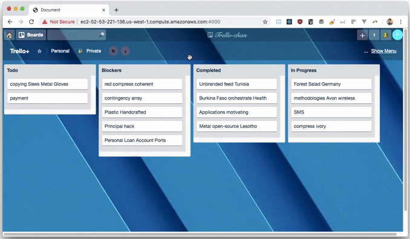

# Trello-chan: Proxy Component

Single-page mock of Trello with components broken up into its own microservice.  All the components are brought together by this Proxy Server

## Preview
Preview of initial and subsequent load times of all 3 services on a single html page

## Features
- All 3 services are compressed and bundled via webpack with code-splitting to optimize page load speed
- Each bundle has an expiration date of 1 year, to minimize need to re-download bundles on subsequent visits
- All API requests will be sent to proxy server, which will then redirect to the appropriate API, which decouples the services and makes refactoring easier.
